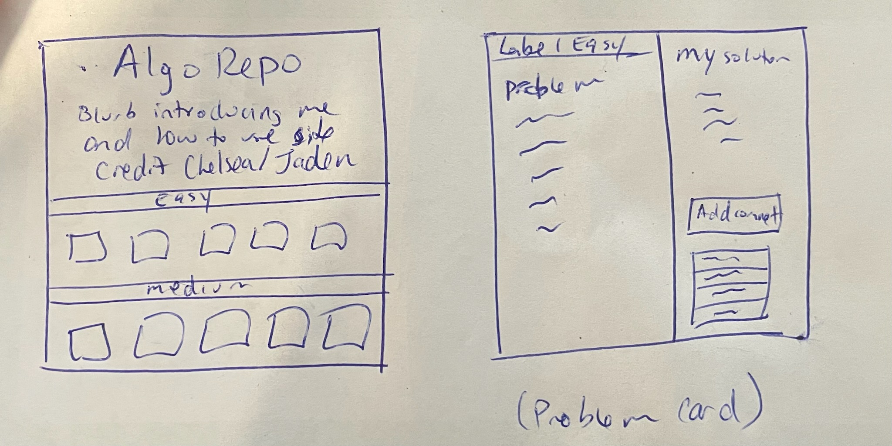

# Practice Algo Repo - UNDER CONSTRUCTION

## Deployed Link
[Practice Algo Repo](https://missatrox44.github.io/algo-practice-problems/)

## Description
Small library of algorithm problems with possible solutions. Users will have ability to comment on solutions and/or post their own. A very special shout out to [Chelsea Sexton](https://github.com/chelsea314) for being my algo partner in crime and [Jaden Rodriguez](https://github.com/Jadentr44) for the great idea to take this app to the next level.

## Table of Contents
- [Installation](#Installation)  
- [Usage](#Usage)
- [License](#License)
- [Contributing](#Contributing)
- [Questions](#Questions)

## Installation
- [Name of Package](packagelink.com)
- [Name of Package](packagelink.com)
- [Name of Package](packagelink.com)

## Usage
Step 1 description

Step 2 description

Step 3 description

NOTE: Anything under construction?

## License
MIT

## Contributing
[Sara Baqla](https://github.com/missatrox44) 

## Questions
Github username: [missatrox44](https://github.com/missatrox44)  
Email: missatrox44@gmail.com